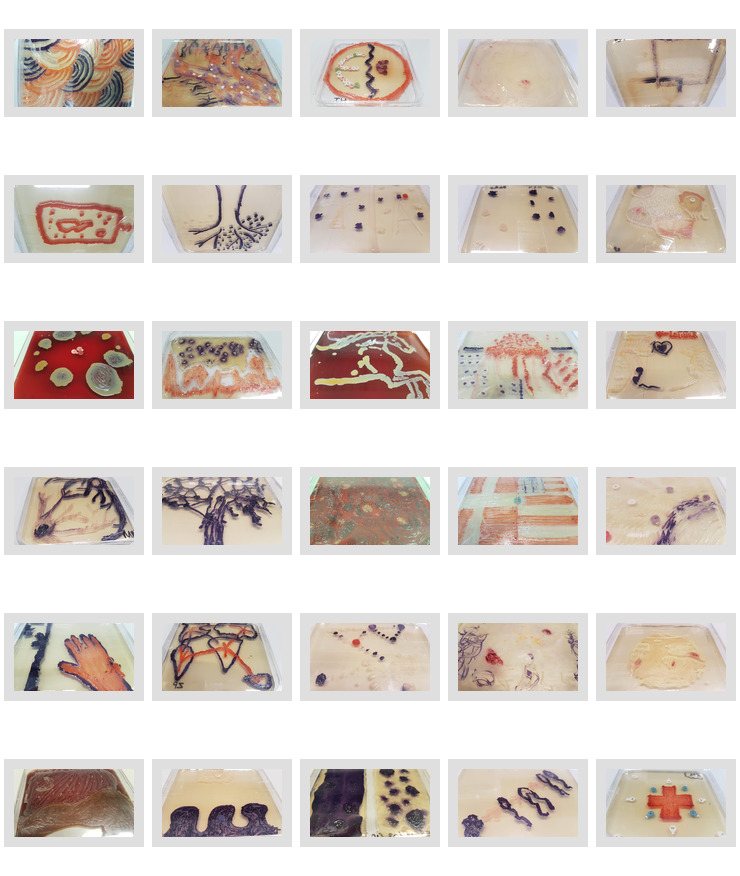
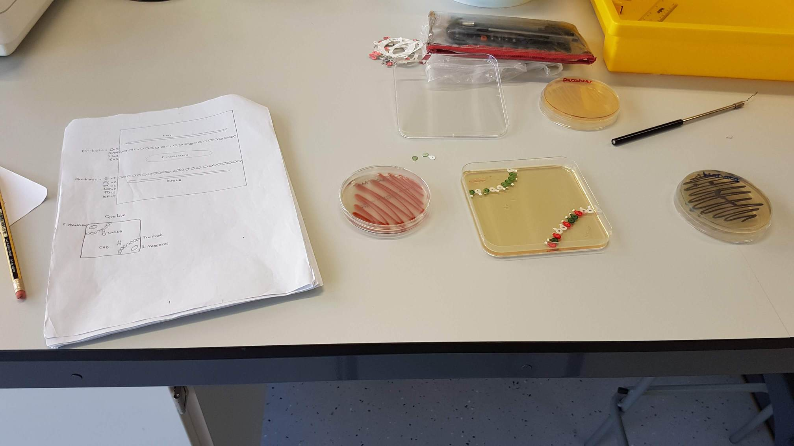

# MicroMart

Documentation of an iteration of the BioArt activity used as a teaching component at the [Faculty of Health & Medicine](https://www.lancaster.ac.uk/health-and-medicine/) at Lancaster University developed by [Dr Rod Dillon](https://www.lancaster.ac.uk/health-and-medicine/about-us/people/rod-dillon) and [Dr Jackie Parry](https://www.lancaster.ac.uk/health-and-medicine/about-us/people/jackie-parry) 

## Images

You can see the files from [2017 here](#)

## Requirements

This is an experiment in documenting this activity as if it were a kit. It is not meant to be used as such it requires Biomedical lab facilities and practices to 'work' safely. This repo documents the translation of this sort of learning-through-design into a safer DIY practice suitable for Domestic or average Hackspace facilities.

## Introduction

As scientists, one of our major roles is to be able to effectively communicate scientific concepts to the general public. This takes a number of forms such as giving oral presentations, producing posters/leaflets etc., all of which require some form of visual stimulus to keep the audience engaged e.g. pictures depicting the disease symptoms, a picture of the bug itself etc.

An emerging medium for communicating scientific concepts is BioArt. One simple example is the use of live micro-organisms on an agar plate instead of paints on a canvas. Microbial colonies vary in their pigmentation (different colours) and their form (smooth, wrinkled, hairy, compact, spreading), providing a range of ‘paints’ to work with.

## Pretty Pictures

However, BioArt is not about making pretty pictures with pretty colonies, it’s about conveying and interpreting scientific concepts which are demonstrated by the micro-organisms on the agar; and which will make sense to the audience.

Plates from the second practical are available and provide you with a vast array of bacterial and fungal colonies that could be used in your artwork. You may see that some colonies are killing others or that some colonies are completely destroying red blood cells. These could be used to demonstrate the processes of for example, antibiosis and cell lysis, respectively. Alternatively, you could use some of the bacteria provided (see below) which have specific features regarding Quorum Sensing and which could be used singly or in combination.

## Quorum sensing
Communication between bacteria is carried out by small diffusible molecules, AHLs (in our Bio Art this might be called a metaphor for words and conversations). The conversations have a positive impact on pathogenic bacteria by causing the up-regulation of virulence factors (and making the cells ‘nasty’). At low cell density, bacteria are essentially harmless because their conversations are too quiet (dilute) to hear but at high cell density the conversations are louder, they are heard and the bacteria respond by becoming virulent and nasty. However, there are some bacteria that can completely destroy bacterial conversations by producing a lactonase (which breaks down AHLs).

## FAQ/Safety :biohazard:

 * Is it safe?
   * No. You need to use standard but rigorous health and safety practices to deal with manipulating potentially dangerous organisms like E Coli on agar plates.
  * Keep lids on plates where possible. Treat all materials as  ***offensive waste***. 

## Getting Started

***Don't get started: the domestic version of this is not ready!***

### Kit List

 * Offensive waste disposal
 * Bunsen Burner and supply
 * Sterile Needle and hoop
 * Surgical scissors
 * Petri dishes
 * Prepared agar from reputable company
 * Incubators for 24 and 37 Centigrade
 * Lab coat
 * Sterile rubber nitrile gloves
 * Safety Glasses
Refrigeration

## Plates

Square petri Plates 15cmx15cm, your 'canvas'

Agar Type|Behaviour|Color
--|--|--
LB agar (1.5%)|Non swarming|Agar beige
Swarm LB agar (0.7%) |Swarming|Agar beige
CB agar (5% blood)|Non swarming|Blood Red

Note: Agar is pre-prepared on plates, we will look into how this could be done in a way that's practical and domestic kitchen safe

## Organisms

Organism|Behaviour|Colour|Description
--------|---------|----------|--------
Chromobacterium violaceum WT|'Talks' with AHL C6|Purple|When in a large colony it ‘hears’ C6. Demonstrate cells that are ‘upregulated’ by Quorum Sensing and which are ‘dangerous’
Chromobacterium violaceum CV026|'Listens' but no 'talk'|White - Purple|Mutant of  WT. Cannot ‘talk’ (does not produce the AHL, C6) but can ‘hear’. Normally white but if bacterium making AHLs C4 or C6 it goes purple. Demonstrates ‘non-dangerous state’ (white colonies) or, if upregulating by AHLs, a ‘dangerous state’ (purple). Only responds to smaller AHLs, C4, C6 (possibly C8) ( aka a ‘high pitched voice’)...the larger AHLs, C10 and C12 (aka a ‘low pitched voice’) do not induce pigment.
Escherichia coli DH5α + aiiA|'Destroyer'|No Colour - Stops it|This strain is a mutant containing the aiiA gene, which encodes for a lactonase. The lactonase destroys any AHLs in its vicinity. This strain therefore ‘destroys bacterial conversations’ and can potentially stop a bacterium from becoming nasty.
Serratia marcescens|'Swarmer'|Red|Red pigment in response to AHL C4. Highly motile can swarm all over an 0.2% agar plate. Responsible for number of nosocomial infections. Can demonstrate something being ‘spread’, whether it be a bacterial conversation or maybe a disease, antibiotic resistance etc. A dirty shower warning sign!
*Serrtatia liquefaciens* | Talks|No pigment|Talks with AHL C4 but no red pigment. Colonies always white, non swarming. White strain (generally non-pathogenic) could be used to contrast with red S. marcescens (pathogenic).
Antibiotic Discs|Blocker|No pigment|Antibiotic susceptibility profiles of each of the above bacteria  together with antibiotic discs. These can be used to demonstrate the effectiveness of antibiotics (if the strain is susceptible) or the inadequacy of antibiotics (if the strain is resistant)

